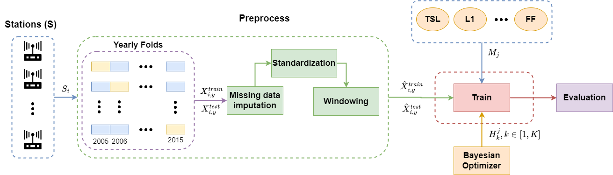

# Embedded feature selection for deep learning applied to ozone forecasting

This repository contains all the code needed to reproduce the experiments in the paper presented by M. J. Jiménez-Navarro et al. 

> Ambient air pollution is a pervasive global issue that poses significant health risks. Among the pollutants, ozone ($O_{3}$) is responsible for an estimated 1 to 1.2 million premature deaths each year. Furthermore, $O_{3}$ adversely affects climate warming, crop productivity, and more. Its formation occurs when nitrogen oxides and volatile organic compounds react with short-wavelength solar radiation. Consequently, urban areas with high traffic volume and elevated temperatures are particularly prone to elevated $O_{3}$ levels, posing a significant health risk to their inhabitants. In response to this problem, many countries have developed web and mobile applications that provide real-time air pollution information using sensor data. However, while these applications offer valuable insights into current pollution levels, predicting future pollutant behavior is crucial for effective planning and mitigation strategies. Therefore, our main objectives are to develop accurate and efficient prediction models and to identify the key factors that influence $O_{3}$ levels. To address these objectives, we adopt a time series forecasting approach, which allows us to analyze and predict future $O_{3}$ behavior. Additionally, we tackle the feature selection problem with the aim of identifying the most relevant features and time periods that contribute to prediction accuracy. Our study focuses on data collected from six representative areas in Seville and Jaen provinces, Spain, using multiple sensors to capture comprehensive pollution data. We compare the performance of three models: Lasso, Decision Tree, and Deep Learning. In particular, we introduce a novel method called the Time Selection Layer, which enhances the effectiveness and interpretability of Deep Learning models. By incorporating the Time Selection Layer, we aim to improve the accuracy and understandability of our predictions. Our results demonstrate that the inclusion of the Time Selection Layer significantly enhances the performance of the Deep Learning model, achieving an average improvement of 9\% across all monitored areas.

## Prerequisites

In order to run the experimentation several dependencies must be installed. A conda environment has been provided for installing all the dependencies:

```
conda env create -f environment.yml
```

alternatively, the requirements has been listed in the `requirements.txt` which can be installed as the following:

```
pip install -r requirements.txt
```

## Reproduce result

#### Reproduce full experimentation

The experimentation is performed via the `experiment.ipynb` notebook which runs the methodology over all datasets and models. The experimentation is made via the `ExperimentLauncher` receiving the following parameters:

* ``config_path``: The path to the three configuration files for the experimentation corresponding to: `data_config.yaml`, `model_config.yaml` and `selection_config.yaml`.
    * ``data_config``: Enumerate all the datasets employed in during the experimentation and its hyperparameter ranges.
    * ``model_config``: Enumerate the models employed and its hyperparameter ranges.
    * ``selection_config``: Enumerate the selection methods and its hyperparameter ranges.

* `save_file`: The csv file which contains all the results obtained in each experimentation.

* `seach_type`: The type of seach over the hyperparameters ranges performed, can be one of bayesian or grid.

* `iterations`: The number of iterations to run the hyperparameter search (only used in bayesian).

#### Reproduce one experiment

In addition to the full experimentation, the reproduce ipynb includes the code needed to executes one single experiment by employing the ``ExperimentInstance`` class. This class only requires a `dict` with the hyperparameters in the following format:

```python
{
    "dataset": {"name": "Aljarafe", "params": 
                        {"seq_len": 41, "pred_len": 24, "shift": 24,"crossval": True}
    }, 
    "selection": {"name": "TSL", "params": 
                                    {"regularization": 0.0088594323988978}
    }, 
    "model": {"name": "dense", "params": 
                                    {"keep_dims": False, "layers": 2 "units": 47,
                                     "dropout": 0.163322450886048, "type": "tensorflow"}
    }
}
```

#### Analysis

Finally, a notebook with the analysis performed in the paper is provided in the `analysis.ipynb` notebook.


## Methodology



